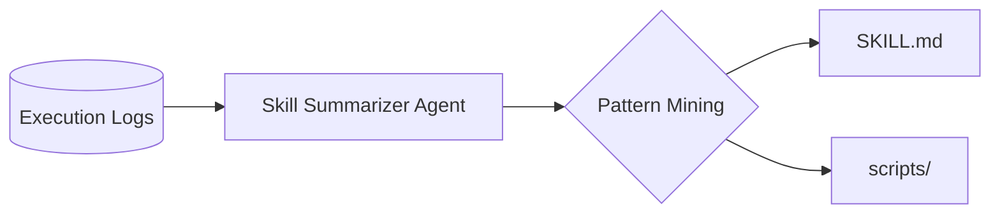

# 🛠️ Skills Summarizer

<p align="right"><strong>🌐 English</strong> | <a href="README_zh.md">中文</a></p>

<p align="center">
  
  
  
  
</p>

> **Evolve your Agent**: Extract, distill, and reuse standardized SKILL assets from messy execution logs.

Extract reusable **SKILL.md** files from agent execution logs. Logs are read as text (any file type or extension—e.g. `.jsonl`, `.log`, `.txt`, or none). The agent analyzes log entries (e.g. tool calls, queries, collected results), identifies repeated successful workflows, and writes standard-compliant skills following the [summarizing-new-skills](skills_summarize_agent/SKILL.md) spec (progressive disclosure, kebab-case names, trigger phrases).

---

## 📖 Table of Contents

- [✨ Key Features](#-key-features)
- [🚀 Quick Start](#-quick-start)
- [📁 Project Layout](#-project-layout)
- [⚙️ Configuration](#️-configuration)
- [🛠️ Usage](#️-usage)
- [📊 Log Format](#-log-format)
- [📦 Bundled Examples](#-bundled-examples)
- [📤 Output](#-output)
- [🏗️ Architecture](#️-architecture)
- [📝 License](#-license)

---

## ✨ Key Features

- **Log-agnostic**: Any file type or extension; JSONL, multi-line JSON, or plain text—the LLM infers workflows from your structure.
- **Standard-compliant**: Outputs follow the [summarizing-new-skills](skills_summarize_agent/SKILL.md) spec (progressive disclosure, kebab-case, trigger phrases).
- **SDK + CLI + Scripts**: Use from Python (`summarize_skills_from_log`), command line (`run_summarize`), or one-liner shell scripts.
- **Bundled samples**: Try it immediately with `data/example1` and `data/example2` via `bash scripts/run_test.sh`.

---

## 🚀 Quick Start

```bash
# 1. Clone and install
git clone https://github.com/doudouwer/skills-summarizer.git
cd skills-summarizer
pip install -e .

# 2. Configure API (recommended: use .env)
cp .env.example .env
# Edit .env: set OPENAI_API_KEY (and optionally OPENAI_BASE_URL, OPENAI_MODEL)

# 3. Run a quick test with bundled sample
bash scripts/run_test.sh
```

> [!TIP]
> For best pattern-recognition results, use **GPT-4o** (default). Set `OPENAI_MODEL` in `.env` if needed.

---

## 📁 Project Layout

| Path | Description |
|------|-------------|
| **`skills_summarize_agent/`** | Python package (SDK, agent, CLI, SKILL spec). |
| **`scripts/`** | Shell entry points: `run_test.sh`, `run_summarize.sh`. |
| **`data/`** | Bundled example log files (see [Bundled examples](#-bundled-examples)). |
| **`output/`** | Default directory for generated SKILLs (created on first run). |
| **`.env.example`**, **`requirements.txt`**, **`pyproject.toml`** | Config and install. |

---

## ⚙️ Configuration

Copy `.env.example` to `.env` in the repo root and set your OpenAI-compatible API (or use env vars directly):

- `OPENAI_API_KEY` (or `SKILL_SUMMARIZER_OPENAI_API_KEY`)
- `OPENAI_BASE_URL` (optional; or `SKILL_SUMMARIZER_OPENAI_BASE_URL`)
- `OPENAI_MODEL` (optional; default `gpt-4o`; or `SKILL_SUMMARIZER_OPENAI_MODEL`)

---

## 🛠️ Usage

### SDK (Python)

Main entry: **`summarize_skills_from_log`**. It reads a log file, runs the agent with read_file / write_file / list_dir tools, and returns the result (success, tool_calls, final_response).

```python
from skills_summarize_agent import summarize_skills_from_log

result = summarize_skills_from_log(
    log_path="data/example1",            # path to log file (any extension; relative or absolute)
    project_root="/path/to/project",     # optional; default: os.getcwd()
    output_root="/path/to/output",       # optional; default: repo output/
    last_n=100,                          # optional; use only last N lines; None = all
)

if result["success"]:
    print(result["final_response"])
else:
    print(result["final_response"])  # error or partial
```

For more control (custom prompts, multiple runs), use **`SkillSummarizerAgent`**:

```python
from skills_summarize_agent import SkillSummarizerAgent

agent = SkillSummarizerAgent(
    project_root="/path/to/project",
    output_root="/path/to/output",
)
out = agent.run("Extract skills from agent_log.jsonl and write SKILL.md files.")
```

### CLI

After `pip install -e .` run from any directory; or from repo root (so the package is on `PYTHONPATH`):

```bash
# use current dir as project root, default output dir
python -m skills_summarize_agent.run_summarize --log_path agent_log.jsonl

# limit to last 100 lines
python -m skills_summarize_agent.run_summarize --log_path /path/to/log.jsonl --last 100

# custom project root and output dir
python -m skills_summarize_agent.run_summarize --project_root /path/to/project --output_dir /path/to/output --log_path data/example1
```

### Shell scripts (run from repo root)

Both scripts live in **`scripts/`** and assume you run them from the **repo root** (they `cd` to repo root and use `output/` there).

| Script | Purpose | Args |
|--------|---------|------|
| **`scripts/run_test.sh`** | Quick test with a bundled sample (`data/example1`). No arguments; writes to `output/`. | (none) |
| **`scripts/run_summarize.sh`** | Summarize **your own** log file. You pass the log path (any extension) and optionally “last N” lines. | `[log_path]` (default: `agent_log`), `[last_n]` (optional) |

Examples (from repo root):

```bash
# quick test with bundled sample
bash scripts/run_test.sh

# summarize a log in repo root (any filename/extension)
bash scripts/run_summarize.sh agent_log

# summarize a log, use only last 100 lines
bash scripts/run_summarize.sh /path/to/log.jsonl 100
```

---

## 📊 Log Format

Log files are read as **text** (any filename or extension). Any format that describes agent runs is supported—e.g. one JSON object per line (JSONL), multi-line JSON, or plain text with tool calls and results. The LLM infers repeated workflows from whatever structure you have; common patterns include:

- `query`, `api_call_history` (or `tool_calls`), `collected_info_sources` (or `results`), `iterations_used`, `info_sufficient`, `confidence`
- Or your own fields that capture “what was tried” and “what succeeded”.

See [Bundled examples](#-bundled-examples) for the two sample logs in `data/`.

---

## 📦 Bundled Examples

Two example log files are included in **`data/`**:

| File | Description |
|------|-------------|
| **`data/example1`** | Single-line JSONL: one agent run with a natural-language query, `api_call_history` (endpoints and params), and `collected_info_sources`. Good for API/tool-call style logs where each line is one completed run. |
| **`data/example2`** | Multi-turn conversation log: a task (e.g. “average rating of top N items”) and a `conversation` array of messages (timestamp, sender, content, role). Good for agentic/conversation logs where the workflow is spread across turns. |

Use them to try the tool: e.g. `--log_path data/example1` or `bash scripts/run_summarize.sh data/example2`.

---

## 📤 Output

Generated SKILLs are written under the **output root** (default: `output/` at repo root). Each skill is typically a subdirectory with a `SKILL.md` (and optionally `scripts/`, `references/`). Naming follows kebab-case, third-person descriptions, and trigger phrases as in [skills_summarize_agent/SKILL.md](skills_summarize_agent/SKILL.md).

---

## 🏗️ Architecture

High-level flow: logs → agent → pattern mining → SKILL assets.



---

## 🎬 Showcase

*Placeholder: add a terminal GIF of `run_summarize.sh` or a screenshot of generated `SKILL.md` in your editor to make the repo more inviting.*

---

## 📝 License

This project is licensed under the **Apache-2.0** License — see the [LICENSE](LICENSE) file for details. The skill spec is in [skills_summarize_agent/SKILL.md](skills_summarize_agent/SKILL.md).
