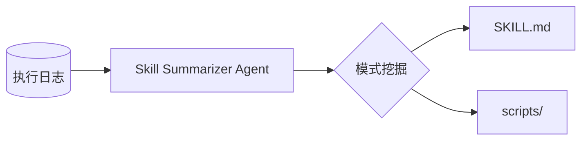

# 🛠️ Skills Summarizer

<p align="center">
  
  
  
  
</p>

> **让 Agent 进化**：从杂乱的执行日志中自动提取、沉淀并复用标准化的 SKILL 资产。

从**任意** Agent 执行日志中抽取可复用的 **SKILL.md**。日志按文本读取（任意文件类型或扩展名，如 `.jsonl`、`.log`、`.txt` 或无后缀）。本 Agent 会分析日志条目（如工具调用、查询、收集结果等），识别重复成功的流程，并按照 [summarizing-new-skills](skills_summarize_agent/SKILL.md) 规范写出符合标准的技能（渐进式披露、kebab-case 命名、触发短语等）。

---

## 📖 目录

- [✨ 核心亮点](#-核心亮点)
- [🚀 快速开始](#-快速开始)
- [📁 项目结构](#-项目结构)
- [⚙️ 配置](#️-配置)
- [🛠️ 使用方式](#️-使用方式)
- [📊 日志格式](#-日志格式)
- [📦 自带示例](#-自带示例)
- [📤 输出](#-输出)
- [🏗️ 架构](#️-架构)
- [📝 许可](#-许可)

---

## ✨ 核心亮点

- **日志无关**：任意文件类型或扩展名；JSONL、多行 JSON 或纯文本均可，LLM 从你的结构推断流程。
- **规范一致**：输出符合 [summarizing-new-skills](skills_summarize_agent/SKILL.md) 规范（渐进式披露、kebab-case、触发短语）。
- **SDK + CLI + 脚本**：可从 Python（`summarize_skills_from_log`）、命令行（`run_summarize`）或一行 Shell 脚本调用。
- **自带样本**：用 `data/example1`、`data/example2` 配合 `bash scripts/run_test.sh` 即可一键体验。

---

## 🚀 快速开始

```bash
# 1. 克隆并安装
git clone https://github.com/doudouwer/skills-summarizer.git
cd skills-summarizer
pip install -e .

# 2. 配置 API（推荐使用 .env）
cp .env.example .env
# 编辑 .env：设置 OPENAI_API_KEY（可选：OPENAI_BASE_URL、OPENAI_MODEL）

# 3. 一键体验测试数据
bash scripts/run_test.sh
```

> [!TIP]
> 建议使用 **GPT-4o**（默认）以获得最佳的模式识别效果。如需更换模型，在 `.env` 中设置 `OPENAI_MODEL`。

---

## 📁 项目结构

| 路径 | 说明 |
|------|------|
| **`skills_summarize_agent/`** | Python 包（SDK、Agent、CLI、SKILL 规范）。 |
| **`scripts/`** | Shell 入口：`run_test.sh`、`run_summarize.sh`。 |
| **`data/`** | 自带示例日志（见 [自带示例](#-自带示例)）。 |
| **`output/`** | 默认生成的 SKILL 输出目录（首次运行时会创建）。 |
| **`.env.example`**、**`requirements.txt`**、**`pyproject.toml`** | 配置与安装。 |

---

## ⚙️ 配置

将 `.env.example` 复制为仓库根目录下的 `.env`，并填写 OpenAI 兼容 API（或直接使用环境变量）：

- `OPENAI_API_KEY`（或 `SKILL_SUMMARIZER_OPENAI_API_KEY`）
- `OPENAI_BASE_URL`（可选；或 `SKILL_SUMMARIZER_OPENAI_BASE_URL`）
- `OPENAI_MODEL`（可选，默认 `gpt-4o`；或 `SKILL_SUMMARIZER_OPENAI_MODEL`）

---

## 🛠️ 使用方式

### SDK（Python）

主入口：**`summarize_skills_from_log`**。读取一个日志文件，用 read_file / write_file / list_dir 工具运行 Agent，并返回结果（success、tool_calls、final_response）。

```python
from skills_summarize_agent import summarize_skills_from_log

result = summarize_skills_from_log(
    log_path="data/example1",            # 日志文件路径（任意扩展名；相对或绝对）
    project_root="/path/to/project",     # 可选；默认 os.getcwd()
    output_root="/path/to/output",       # 可选；默认仓库 output/
    last_n=100,                          # 可选；只使用最后 N 行；None 表示全部
)

if result["success"]:
    print(result["final_response"])
else:
    print(result["final_response"])  # 错误或部分结果
```

需要自定义提示或多轮调用时，可使用 **`SkillSummarizerAgent`**：

```python
from skills_summarize_agent import SkillSummarizerAgent

agent = SkillSummarizerAgent(
    project_root="/path/to/project",
    output_root="/path/to/output",
)
out = agent.run("从 agent_log.jsonl 中抽取 skill 并写出 SKILL.md。")
```

### CLI

先执行 `pip install -e .` 后可在任意目录运行；或在仓库根目录运行（保证包在 `PYTHONPATH` 中）：

```bash
# 以当前目录为 project root，使用默认 output 目录
python -m skills_summarize_agent.run_summarize --log_path agent_log.jsonl

# 只使用最后 100 行
python -m skills_summarize_agent.run_summarize --log_path /path/to/log.jsonl --last 100

# 指定 project root 和 output 目录
python -m skills_summarize_agent.run_summarize --project_root /path/to/project --output_dir /path/to/output --log_path data/example1
```

### Shell 脚本（在仓库根目录执行）

两个脚本都在 **`scripts/`** 下，请在 **仓库根目录** 运行（脚本会先 `cd` 到仓库根目录，并使用根目录下的 `output/`）。

| 脚本 | 用途 | 参数 |
|------|------|------|
| **`scripts/run_test.sh`** | 用自带样本 `data/example1` 做一次快速测试。无参数；写入 `output/`。 | 无 |
| **`scripts/run_summarize.sh`** | 对你**自己的**日志做总结。传入日志路径（任意扩展名）及可选的「最后 N 行」。 | `[log_path]`（默认 `agent_log`）、`[last_n]`（可选） |

示例（在仓库根目录执行）：

```bash
# 用自带样本快速测试
bash scripts/run_test.sh

# 对仓库根目录下的日志做总结（任意文件名/扩展名）
bash scripts/run_summarize.sh agent_log

# 对指定日志做总结，只使用最后 100 行
bash scripts/run_summarize.sh /path/to/log.jsonl 100
```

---

## 📊 日志格式

日志按**文本**读取，**任意文件名或扩展名**均可。只要能在内容里看出 agent 的运行过程即可——例如每行一个 JSON（JSONL）、多行 JSON、或带工具调用与结果的纯文本。LLM 会从现有结构推断重复流程；常见字段包括：

- `query`、`api_call_history`（或 `tool_calls`）、`collected_info_sources`（或 `results`）、`iterations_used`、`info_sufficient`、`confidence`
- 或你自己表示「尝试了什么」「是否成功」的字段。

`data/` 下自带两个示例，见 [自带示例](#-自带示例)。

---

## 📦 自带示例

**`data/`** 下附带两个示例日志：

| 文件 | 说明 |
|------|------|
| **`data/example1`** | 单行 JSONL：一次 agent 运行，包含自然语言 query、`api_call_history`（端点与参数）和 `collected_info_sources`。适合「每行一次完整运行」的 API/工具调用类日志。 |
| **`data/example2`** | 多轮对话日志：一个任务（如「计算前 N 项平均分」）和 `conversation` 数组（timestamp、sender、content、role）。适合多轮 agent/对话式日志。 |

可用它们试跑：例如 `--log_path data/example1` 或 `bash scripts/run_summarize.sh data/example2`。

---

## 📤 输出

生成的 SKILL 会写在 **output 根目录** 下（默认是仓库根目录的 `output/`）。每个技能通常是一个子目录，内含 `SKILL.md`，以及可选的 `scripts/`、`references/`。命名遵循 kebab-case、第三人称描述和触发短语，详见 [skills_summarize_agent/SKILL.md](skills_summarize_agent/SKILL.md)。

---

## 🏗️ 架构

整体流程：日志 → Agent → 模式挖掘 → SKILL 资产。



---

## 🎬 演示

*占位：可在此添加 `run_summarize.sh` 的终端 GIF，或生成后的 `SKILL.md` 在编辑器中的截图，让仓库更直观。*

---

## 📝 许可

本仓库采用 **Apache-2.0** 许可证，详见 [LICENSE](LICENSE)。技能规范见 [skills_summarize_agent/SKILL.md](skills_summarize_agent/SKILL.md)。
